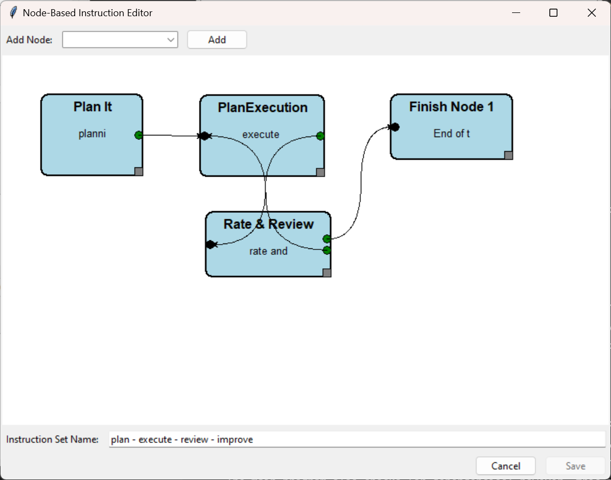
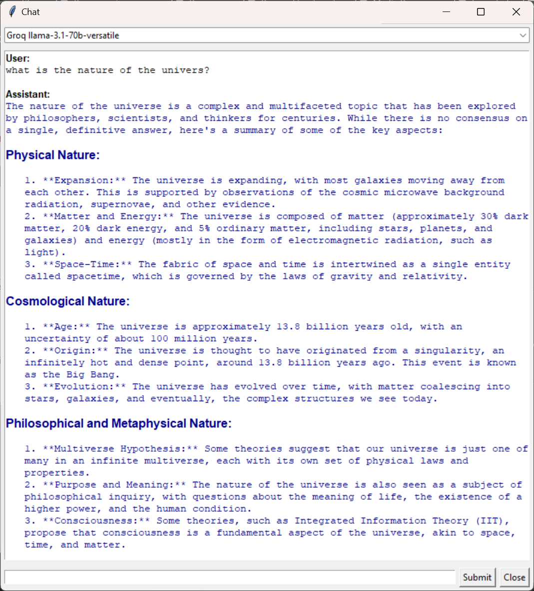
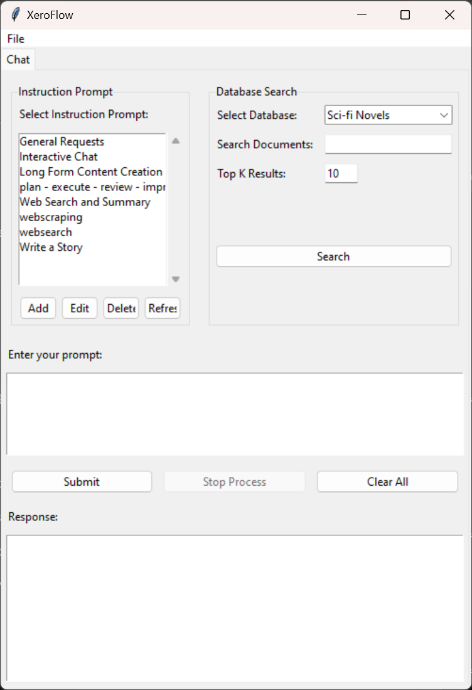
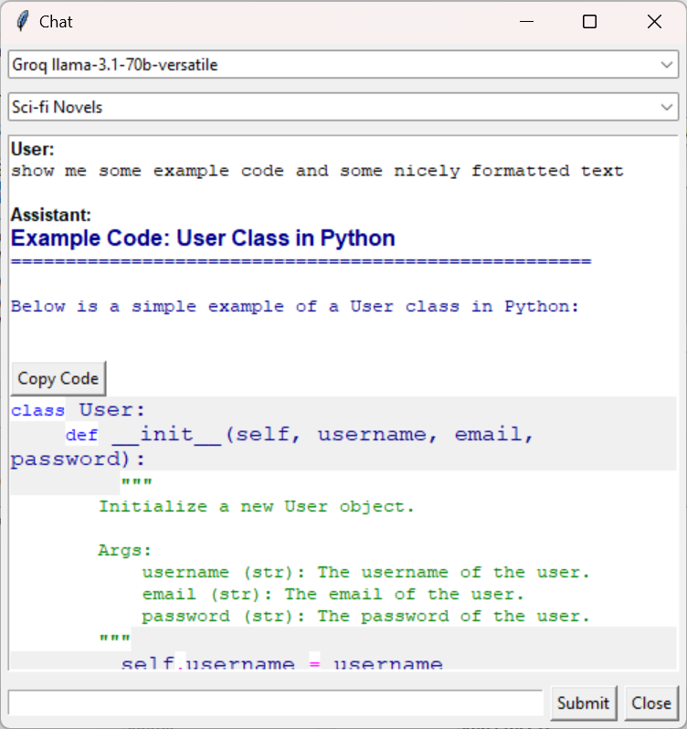
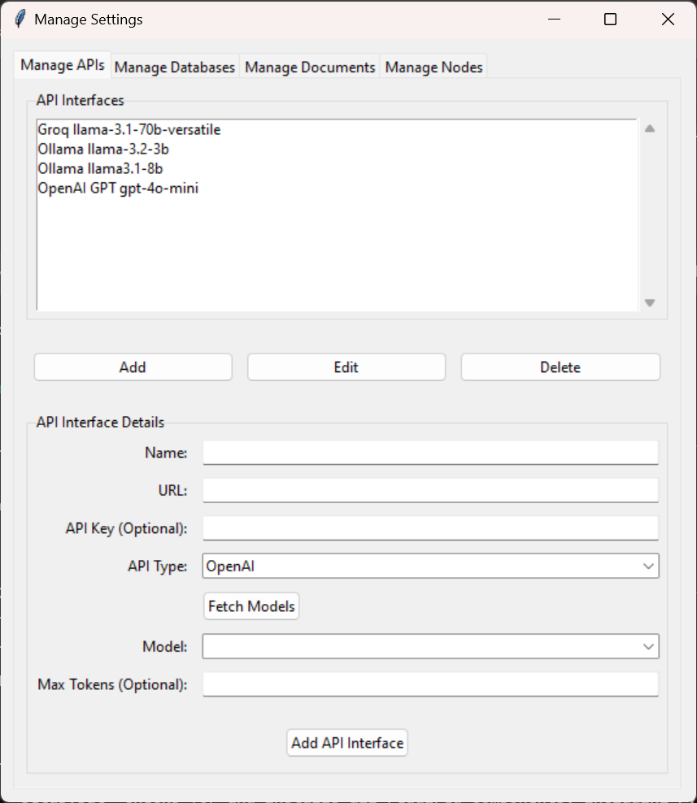

# XeroFlow

<table>
  <tr>
    <td align="center"></td>
    <td align="center"></td>
    <td align="center"></td>
  </tr>
  <tr>
    <td align="center"></td>
    <td align="center"></td>
    <td></td> <!-- Empty cell for alignment -->
  </tr>
</table>

<!-- Title and centered video link below the table -->
<h2 align="center">Watch the Tutorial Here</h2>
<p align="center">
  <a href="https://youtu.be/dxEQNHmMuqQ">
    
  </a>
</p>

[GitHub Repository](https://github.com/Xerophayze/XeroFlow)

XeroFlow is a node-based interface for managing and interacting with various Large Language Model (LLM) APIs. It provides a flexible and customizable platform for building workflows that integrate multiple APIs to generate and manage content. The platform allows users to visually create, connect, and manage these workflows through a graphical interface. This system is designed to be modular, making it easy to expand with new nodes or APIs as required.

## Features

### 1. **Node-Based Workflow Creation**
   - XeroFlow allows users to design workflows using a visual interface. Nodes represent different functions, processes, or APIs that you want to interact with. The nodes can be connected to define the data flow between them.
   - The node editor provides intuitive drag-and-drop functionality, allowing users to design and configure complex workflows without having to manage the underlying code manually.
   - The workflow consists of different types of nodes like **Start**, **Processing**, and **Finish** nodes, which can be customized and connected to form powerful automation pipelines.
   - Newly added advanced nodes include capabilities like database search and interactive chat.

### 2. **Improved Setup with Batch and Bash Files**
   - The installation process is streamlined using two batch or bash files depending on if you are using windows or linux:
     - `setup.bat` or `setup.sh` checks for and installs all required components, including Python and pip, if not already installed.
     - `run.bat` or `run.sh` sets up a virtual environment and runs the main program.
   - The main program also checks for dependencies; however, this may be further refined in future updates.

### 3. **Enhanced Node Editor with New Advanced Nodes**
   - The node editor has been expanded with several advanced nodes, including:
     - **Interactive Chat Node**: Incorporates database search functionality through the `/doc` command, allowing users to query documents directly within the chat.
     - **Long-Form Content Creation Mode**: Designed to generate long-form content such as stories, manuals, blog posts, etc. An example in the database includes a 90,000-word sci-fi story with 30 chapters and multiple subsections.
   - A refined management panel consolidates various management tasks (like API endpoints, databases, document management, and node management) into a single interface with multiple tabs.

### 4. **API Integration**
   - The system supports integrating multiple LLM APIs by allowing users to connect and configure API endpoints. The interface manages multiple API keys and credentials for smooth integration with various LLM providers.
   - By using the editor, users can create workflows that leverage multiple APIs in sequence or in parallel, generating complex interactions that combine the strengths of each connected service.
   - Common API integrations can include OpenAI, Ollama, and others that support LLM-based content generation.

### 5. **Graphical Interface for Node Management**
   - A GUI-based node editor (built with Tkinter) is the core component of XeroFlow. The interface allows users to:
     - Add new nodes (LLM APIs, content generation processes, etc.)
     - Connect nodes to create workflows
     - Save, modify, and reload existing workflows
     - Resize, drag, and modify node positions easily
   - Each node is identified using a unique ID (generated via `uuid`), and the editor manages the internal state of each node and connection.

### 6. **Database Search in Main Interface**
   - Users can directly perform database searches within the main interface, allowing for quick and easy access to document information without requiring specific nodes or workflows.

### 7. **Dependency Management**
   - The system includes utilities for checking and installing dependencies (like `requests`, `PyYAML`, and `Pygments`).
   - For components that cannot be installed via `pip` (e.g., `Tkinter`), users will be notified to install them manually.

## How to Use

### Windows Installation

1. **Install Python and Pip:**
   - Ensure you have Python (version 3.8 or higher) and pip installed on your system. You can download and install them from the official [Python website](https://www.python.org/downloads/).

2. **Clone the Repository:**
   ```
   git clone https://github.com/Xerophayze/XeroFlow.git
   cd XeroFlow
   ```

3. **Run the Setup:**
   Run the setup script to install necessary dependencies:
   ```
   setup.bat
   ```

4. **Run the Application:**
   Start the application with `run.bat`, which will set up a virtual environment and launch the main program:
   ```
   run.bat
   ```

5. **Build Your Workflow:**
   Use the node editor to design and connect different APIs and functions. Save and manage your workflows easily using the provided interface.

### Linux/Mac Installation

1. **Download `setup.sh`:**
   - Download the `setup.sh` script from the repository and place it in the folder where you plan to clone the XeroFlow project.

2. **Make `setup.sh` Executable:**
   - Make sure the `setup.sh` script has executable permissions:
   ```
   chmod +x setup.sh
   ```

3. **Run the Setup Script:**
   - Run the `setup.sh` script to clone the repository and install dependencies and set up the environment:
   ```
   ./setup.sh
   ```

4. **Change Directories:**
   ```
   cd XeroFlow
   ```

5. **Ensure `run.sh` is Executable:**
   - Once inside the `XeroFlow` project folder, ensure that the `run.sh` file has executable permissions:
   ```
   chmod +x run.sh
   ```

6. **Run the Application:**
   - Launch the program with:
   ```
   ./run.sh
   ```

   **Note:** On Linux systems without GPUs or CUDA modules, the setup script will automatically download the necessary files to enable CPU utilization for running the software.

7. **Build Your Workflow:**
   Use the node editor to design and connect different APIs and functions. Save and manage your workflows easily using the provided interface.

### API Endpoint Setup

Once you have completed the initial installation and started XeroFlow, you will need to set up your API endpoints:

1. Go to the **File** menu and select **Management**.
2. Under the **API Management** tab, you can begin adding your API endpoints.
3. For OpenAI-style endpoints, enter the API URL (e.g., `https://api.openai.com/`) and provide your API key.
4. For Ollama-style endpoints, you can enter the URL of your Ollama system, such as `http://192.168.76.130:11434`.
5. You can also configure other OpenAI-conformant endpoints, such as Groq with the URL `https://api.groq.com/openai/`.

Once your API endpoints are configured, you can start building workflows that integrate these endpoints to power your nodes and processes.

## Future Enhancements
- **Database Selection Improvement**: Currently, the database selection dropdown in the interactive chat node does not function fully and defaults to the database specified in the node’s properties.
- **Additional Advanced Nodes**: Adding nodes for logic processing, loops (repeater nodes), and more will further expand the capabilities of XeroFlow.
- **Directory Structure**: The directory will be organized further, moving all required modules into a dedicated subdirectory to streamline the root structure.

## Contributions
Contributions are welcome! Feel free to submit pull requests or report issues. Please review the contribution guidelines before getting started.
